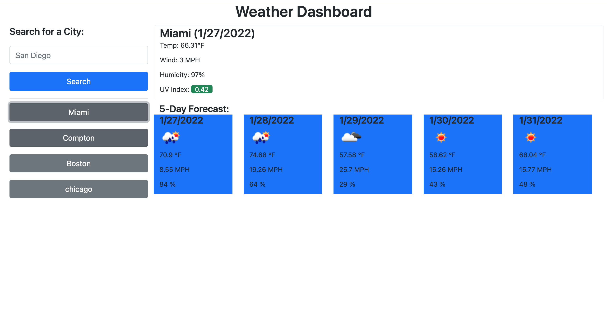

# Weather App
    

## Description 
an app made to track the weather for the next 5 days

 ### This project can be found:

- [GitHub Repository](https://github.com/codemasterdev/weather-app)
- [Live Deployment](https://codemasterdev.github.io/weather-app)

## Technologies

> The following were used in this project:

- `HTML`
- `CSS`
- `Bootstrap`
- `Git`
- `GitHub`
- `JavaScript`
- `Jquery`
- Coded with `VS Code`

## Contribution
Made with ❤️ by [Devon Webster]

## Images

